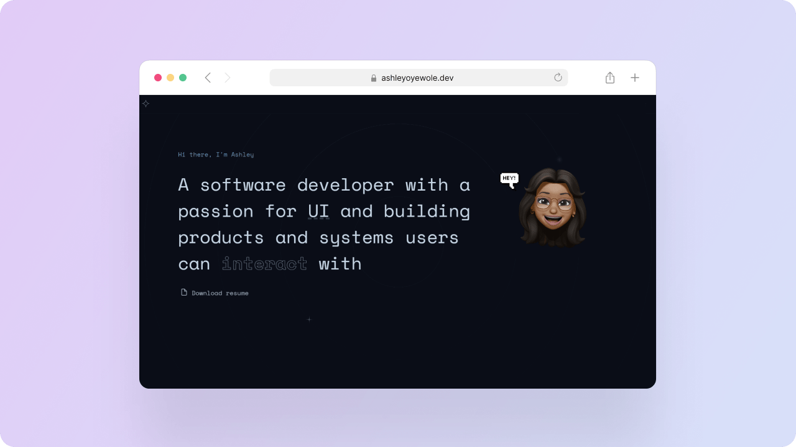

<h1 align="center">
  ashleyoyewole.dev
</h1>

<p align="center">Version 2.0 of my personal website built with React.js and hosted with Netlify</p>
<p align="center">(Migrated to Next.js)</p>
<p align="center">
<a href="https://ashleyoyewole.me/">Launch new site</a>
</p>
<p align="center">
  
</p>

## Setup
1. Install Netlify CLI

   ```sh
   npm install netlify-cli -g
   ```
   
3. Install dependencies

   ```sh
   npm install
   ```

3. Start the development server

   ```sh
   npm start
   ```

## Build and run for production using Netlify

1. Generate a full static production build

   ```sh
   npm run build
   ```
2. Preview the site as it will appear once deployed

   ```sh
   netlify deploy
   ```

## Figma Exploration
https://www.figma.com/file/t4kSYIGuWfaNjHH3NuIEgy/v2.0?node-id=221%3A79
