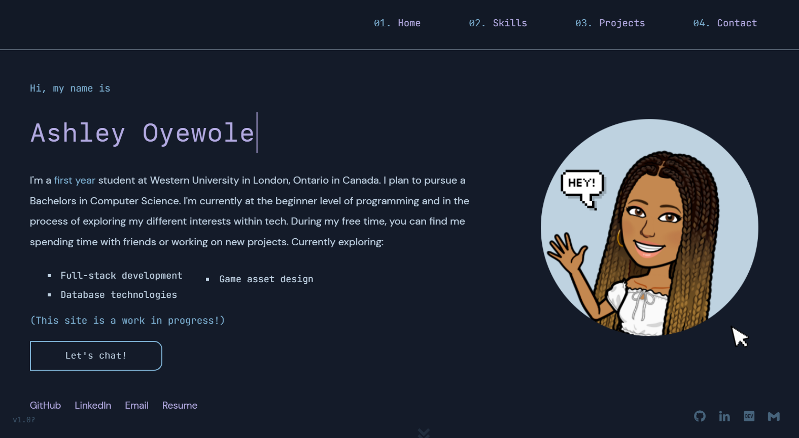

<p align="center">
  
</p>

<h1 align="center">
  aoyewole.netlify.app
</h1>

<p align="center">v2.0 of my personal website built with React.js and hosted with Netlify</p>
<p align="center">
<a href="https://aoyewole.netlify.app/">Launch site</a>
</p>
<p align="center">
  
</p>

## Setup

1. Install dependencies

   ```sh
   npm install
   ```

2. Start the development server

   ```sh
   npm start
   ```

## Build and run for production

1. Generate a full static production build

   ```sh
   npm run build
   ```
2. Preview the site as it will appear once deployed

   ```sh
   npm run serve
   ```

## Colour palette

| Colour          | Hex                                                                |
| -------------- | ------------------------------------------------------------------ |
| Primary        |  `#b3aae2` |
| Secondary      |  `#7cafd1` |
| Background     |  `#141b29` |